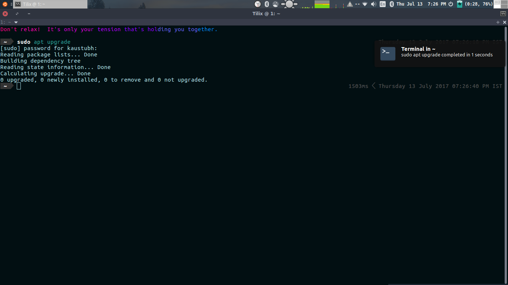

# NotiFyre

It's lit :fire:

Notify when a terminal task is done



[Sample working video](https://drive.google.com/open?id=0B5iU6cWw36rObk9tNDEwNmhjTzA), sped up at x2.

Install dependencies first :

    sudo apt-get install notify-osd pulseaudio-utils libnotify-bin

The above dependencies are generally preinstalled in most working systems. Works perfect on a fresh install of ubuntu 16.04. The following steps will differ according to the shell you use. Tested for bash, zsh and fish shell.

## Bash / zsh shell

* Place both the .sh files, `notifyre.sh` & `bash-preexec.sh` in your home folder.
```
git clone https://github.com/kaustubhhiware/NotiFyre.git
cd NotiFyre
cp notifyre.sh bash-preexec.sh ~
```

* :zap: Lightning fast alternative:

 ```
 # Pull the files from Github
 curl https://raw.githubusercontent.com/kaustubhhiware/NotiFyre/master/notifyre.sh -o ~/notifyre.sh

 curl https://raw.githubusercontent.com/rcaloras/bash-preexec/master/bash-preexec.sh -o ~/bash-preexec.sh

 ```

Now you need to edit your terminal config to start using NotiFyre : `sudo nano ~/.bashrc `

Add the following lines there :

<pre style="background: rgb(238, 238, 238); border: 1px solid rgb(204, 204, 204); padding: 5px 10px;">
source ~/notifyre.sh
source ~/bash-preexec.sh # as close to end as possible</pre>

These 2 lines should be added as close to the end of the file as possible.

* If you do not want to be notified for each command, then only the first line is to be added. In this case, get notified using `nf command`

The second file is written by Ryan Caloras and the source for that could be found [here](https://github.com/rcaloras/bash-preexec).

## Fish shell

* Place the *prompt_pwd.fish*, _notifyre.fish_ and _nf.fish_ in  your `~/.config/fish/functions/` folder.
```
git clone https://github.com/kaustubhhiware/NotiFyre.git
cd NotiFyre
cp prompt_pwd.fish notifyre.fish nf.fish ~/.config/fish/functions/
```

* :zap: Lightning fast alternative:

 ```
 # Pull the files from Github
 curl https://raw.githubusercontent.com/kaustubhhiware/NotiFyre/master/prompt_pwd.fish -o ~/.config/fish/functions/prompt_pwd.fish
 curl https://raw.githubusercontent.com/kaustubhhiware/NotiFyre/master/notifyre.fish -o ~/.config/fish/functions/notifyre.fish
 curl https://raw.githubusercontent.com/kaustubhhiware/NotiFyre/master/nf.fish -o ~/.config/fish/functions/nf.fish
 ```
### Usage

* To be notified for each process, add this to your `functions/fish_prompt.fish`
file just before the end :

 <pre style="background: rgb(238, 238, 238); border: 1px solid rgb(204, 204, 204); padding: 5px 10px;">function fish_prompt
    ...

    eval (notifyre)  # at the very end
 end</pre>

 This method works pretty well with my **bobthefish** theme and no theme as
well. Let me know if it doesn't work out for you.


* If you want to be notified only for select commands, you do
not need to modify the `fish_prompt.fish` file.

 Run with `nf command`

 [This might take slightly more time than the process itself to complete execution.]

You can learn to write your own functions in fish with [this](https://fishshell.com/docs/current/tutorial.html) as a starting point. The working files can be found [in my
  dotfiles](https://github.com/kaustubhhiware/dotfiles/tree/master/fish).

## Configure

<pre style="background: rgb(238, 238, 238); border: 1px solid rgb(204, 204, 204); padding: 5px 10px;">
[ $(($(date +%s) - start)) -le 0 ] || notify-send "Terminal process" "$(echo $@) completed in $(($(date +%s) - start)) seconds" -i utilities-terminal -t 2000</pre>

The above line in notifyre.sh can be changed to your convenience.

* `-le 0`  notifies for commands which are completed in more than 0 seconds. Can be changed to 2, 3 seconds.

* ` "Terminal process" ` is the title of the notification.

* `-i utilities-terminal` defines the icon to be used. Specify your own icon with `-i /path/to/img`. An alternate image has been provided as _terminal.png_

* `̶ ̶t̶ ̶2̶0̶0̶0̶`̶ ̶m̶e̶a̶n̶s̶ ̶t̶h̶e̶ ̶n̶o̶t̶i̶f̶i̶c̶a̶t̶i̶o̶n̶ ̶l̶a̶s̶t̶
s̶ ̶f̶o̶r̶ ̶2̶0̶0̶0̶ ̶m̶i̶l̶l̶i̶s̶e̶c̶o̶n̶d̶s̶.[An incorrect design decision is a bug](http://askubuntu.com/questions/110969/notify-send-ignores-timeout)

* Provide your own notification tone by editing this line.
`ALERT=/usr/share/sounds/ubuntu/notifications/Slick.ogg`


Note:  The notifications appear in a queue, and cannot be implemented parallely.
 (Known bug in notify-send).

Alternatively, you could force-kill notifications when the next one is ready by
adding this line at the top of `notif()` - `killall notify-osd` but the results aren't consistent. So yeah, one at a time.

# Why this
I had to reinstall Ubuntu quite a number of times thanks to how awesome Windows messed up my laptop. This script seeks to help anyone who multi-tasks, or does not constantly check their terminals. [ntfy](https://github.com/dschep/ntfy) wasn't consistent always, so made this.

Tested on fresh install of Ubuntu 16.04, and on Arch Linux. Ubuntu 14 may require [Slick.ogg](Slick.ogg) whose path must be changed before usage.

## Not working/ Message not displayed
check if notify-osd is working with this - `notify-send "hi"`

If no message pops up, it means notify-osd has stopped working. Reinstall some dependencies and try again:

    sudo apt-get --reinstall install libnotify-bin notify-osd

For further customizations, visit this [link](http://ubuntuhandbook.org/index.php/2014/04/customize-on-screen-notification-ubuntu-1404/)

Have a suggestion? Make an issue about it.

# License

The MIT License (MIT) 2017 - [Kaustubh Hiware](https://github.com/kaustubhhiware). Please have a look at the [LICENSE.md](LICENSE.md) for more details.
